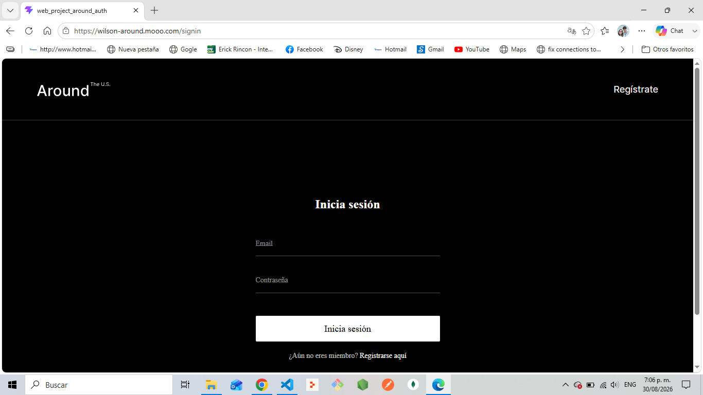
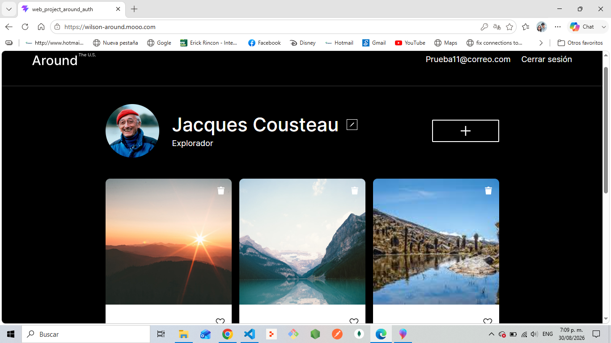

# 🌍 Around - Proyecto sprint 19 Fullstack

## 📝 Descripción del Proyecto
Around es una aplicación web fullstack que permite a los usuarios registrarse, iniciar sesión, gestionar su perfil (nombre, descripción y avatar) y interactuar con un muro de tarjetas (crear, eliminar y dar "me gusta"). 

Este proyecto representa la culminación del desarrollo frontend y backend, implementando buenas prácticas de seguridad, validación de datos, manejo de errores y despliegue en un servidor en la nube.

## 🚀 URL de la Aplicación
- **Frontend**: [https://wilson-around.mooo.com](https://wilson-around.mooo.com)
- **Backend API**: [https://api.wilson-around.mooo.com](https://api.wilson-around.mooo.com)

## 🛠️ Tecnologías Utilizadas
### Frontend
- React.js
- Vite
- HTML5, CSS3, JavaScript (ES6+)

### Backend
- Node.js
- Express.js
- MongoDB + Mongoose
- JWT (JSON Web Tokens) para autenticación
- Celebrate (Joi) para validación de esquemas
- Dotenv para variables de entorno

### Infraestructura y Despliegue
- Google Cloud Platform (Compute Engine)
- Nginx (Reverse Proxy y servidor web)
- PM2 (Gestión de procesos y reinicio automático)
- Let's Encrypt (Certificados SSL/HTTPS)

## ✨ Funcionalidades Principales
- ✅ Registro e inicio de sesión de usuarios con JWT.
- ✅ Visualización, creación y eliminación de tarjetas.
- ✅ Sistema de "me gusta" en las tarjetas.
- ✅ Edición de perfil y actualización de avatar.
- ✅ Validación estricta de datos de entrada (celebrate).
- ✅ Manejo centralizado de errores y logging (request.log / error.log).
- ✅ Tolerancia a fallos: reinicio automático del servidor con PM2.

## 📸 Capturas de Pantalla



## 💻 Instrucciones para Ejecutar Localmente

### Requisitos previos
- Node.js (v18 o superior)
- MongoDB corriendo localmente o URI de MongoDB Atlas

### 1. Clonar el repositorio
```bash
git clone https://github.com/wilsonwilsoon81-sudo/web_project_api_full.git
cd web_project_api_full

### 2. Configurar el Backend
```bash
cd backend
npm install
# Opcional: crear archivo .env con JWT_SECRET y PORT
npm run dev

El backend estará disponible en http://localhost:3000

### 3. Configurar el Frontend

```bash
cd ../frontend
npm install
npm run dev

El frontend estará disponible en http://localhost:3001 (o el puerto que indique Vite)

Desarrollado por Wilson Rolando Herrera Romero como proyecto sprint 19 del curso de Desarrollo Web Fullstack.
